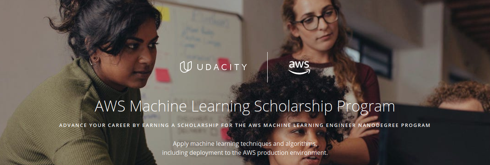

# AWS-Machine-Learning-Foundations-Scholarship
AWS and Udacity are collaborating to educate developers of all skill levels on machine learning concepts. The goal for this program is to up-level machine learning skills to all, and to cultivate the next generation of ML leaders across the world, with a focus on underrepresented groups. Through this Udacity Powers Tech Program, AWS collaborates with professional organizations that are leading initiatives to increase the diversity and talent in technical roles, including organizations like Girls In Tech and the National Society of Black Engineers. 

Feeling stuck amidst the course? Feel free to refer this repository or reach out to me on Slack!

✨| Udacity AWS Machine Learning Foundations Nanodegree Program | Status
--- | ---| ---
1 | Welcome to the AWS Machine Learning Foundations Course | &#9744;
2 | Introduction to Machine Learning |  &#9744;
3 | Machine Learning with AWS |  &#9744;
4 | Software Engineering Practices, part 1 |  &#9744;
5 | Software Engineering Practices, part 2 |  &#9744;
6 | Object-Oriented Programming |  &#9744;
7 | AWS ML Foundations Assessment | &#9744;

## Status Definitions
 &#9744; Means that the particular Chapter is not started yet 👍  
 &#9746; Means that the particular Chapter is under progress 👨‍💻  
 &#9745; Means that the particular Chapter is completed 🎉
 
 
 ## How does this scholarship program work?
 # Phase 1: Scholarship Foundations Course
 # Phase 2: Full Scholarship for a Udacity Nanodegree program

## Are there any non-technical prerequisites or costs associated with this program?
* Both the foundations course and Nanodegree program will require performing tasks in the AWS console on an active AWS account. 
* Learners will need to submit a credit card on file with AWS to create an AWS account. 
* The required exercise can be completed using AWS Free Tier services. 
* Learners may incur a cost if they complete the optional exercise.
 
 
 ## Want to Contribute?
 Fork the repo and send PRs.
 
 Do :star: this repository to keep a track of the course. 
 
 Made with :heart: by [Shivansh](https://github.com/Shivansh2407)
 
 

